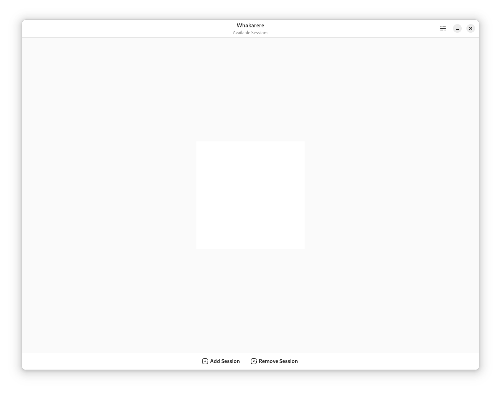
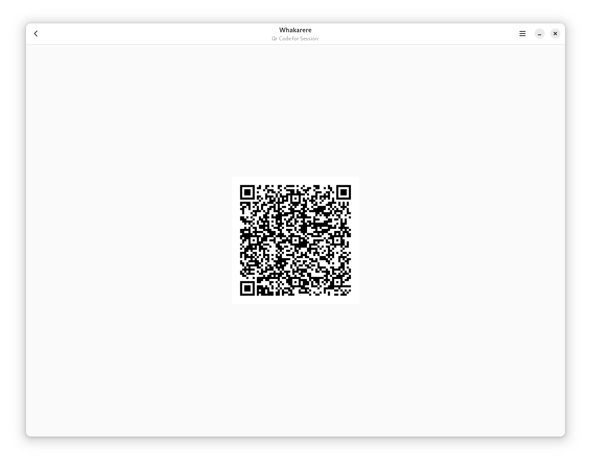

# Whakarere - Gtk4 WhatsApp Client

The new redesigned UI is halfway done, all with native elements.

Here are some screenshots:

 
 

## To-Do List

### Main Features
- [X] Implement basic UI structure.
- [X] Design and integrate main screen elements.
- [X] Develop session management functionality.
- [X] Design and integrate QR code scanning elements.
- [X] Design and integrate a about windows, app information.
- [ ] Design and integrate authenticated session screen elements. 

### Additional Features
- [ ] Add support for multimedia messages.
- [ ] Implement group chat functionality.
- [ ] Integrate notification system.

### UI/UX Enhancements
- [ ] Refine color scheme and styling.
- [ ] Improve navigation flow.
- [ ] Enhance user feedback for actions.

### Technical Improvements
- [ ] Optimize code for better performance.
- [ ] Implement error handling and edge case scenarios.
- [ ] Conduct code reviews for quality assurance.

## Bugs and Issues
- [ ] Fix issue with QR code scanning screen.
- [ ] Address UI rendering problem on smaller screens.
- [ ] Resolve occasional connection errors.

## Documentation
- [ ] Update README with installation instructions.
- [ ] Provide code comments for better code understanding.
- [ ] Create user documentation for key features.

## Testing
- [ ] Perform unit testing for critical functions.
- [ ] Address and fix any issues discovered during testing.

## Release
- [ ] Prepare for the new build release.
- [ ] Create release notes.
- [ ] Push new build to flathub.
