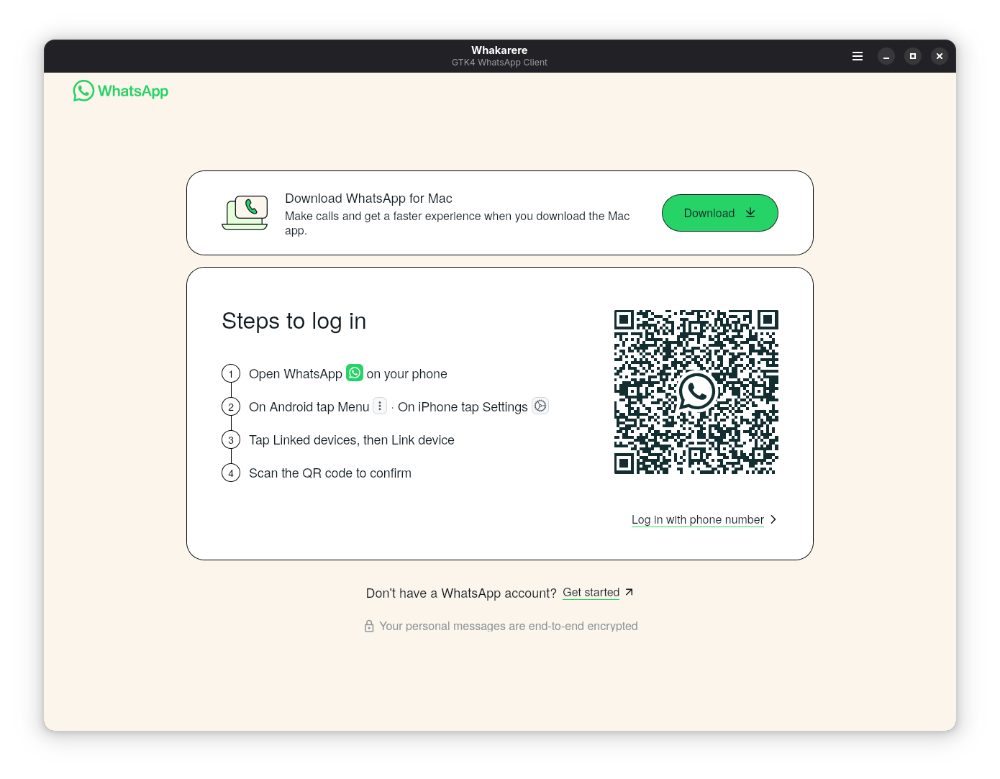
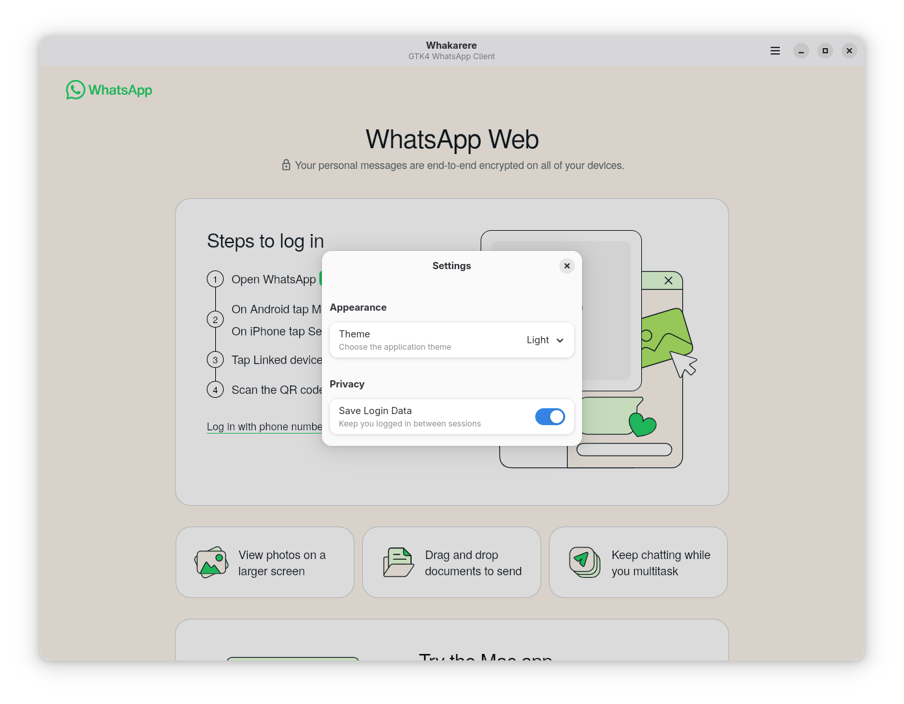
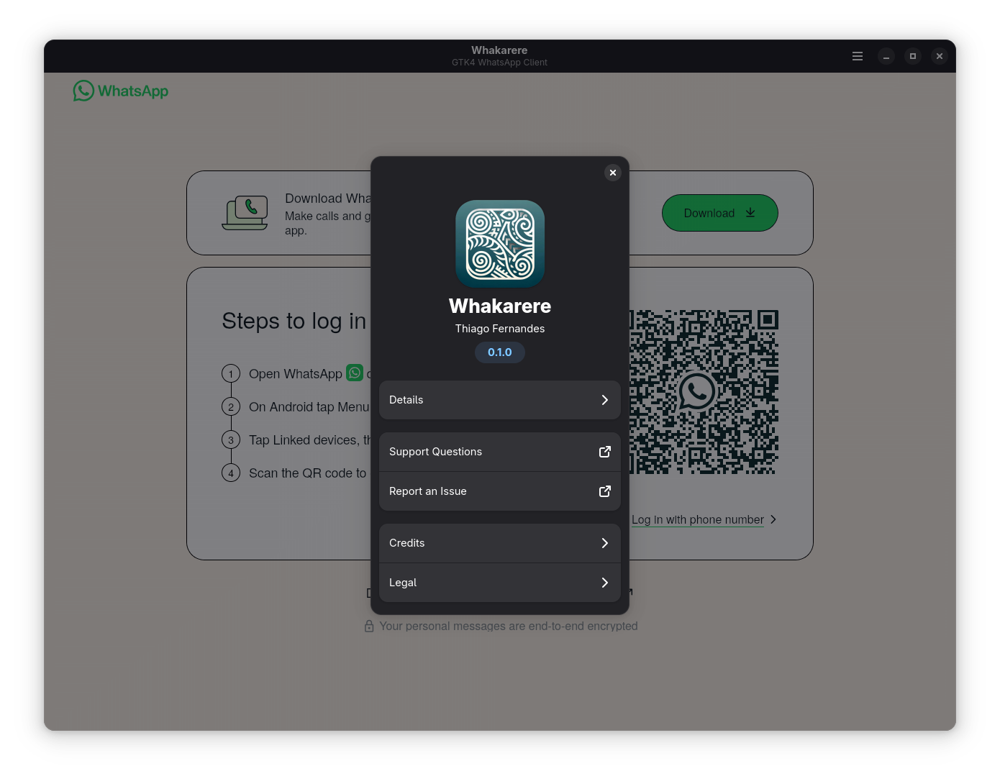

# Karere - GTK4 WhatsApp Client

<p align="center">
  
</p>

<p align="center">
  <strong>A modern, native GTK4 WhatsApp client for Linux</strong>
</p>

<p align="center">
  <a href="#features">Features</a> •
  <a href="#installation">Installation</a> •
  <a href="#building-from-source">Building</a> •
  <a href="#usage">Usage</a> •
  <a href="#contributing">Contributing</a>
</p>

---

## Overview

Karere is a native GTK4 application that provides a seamless WhatsApp Web experience integrated with your Linux desktop. Built with modern technologies like Libadwaita, Blueprint UI, and WebKitGTK 6.0, it offers a clean, responsive interface that follows GNOME design principles.

## Features

### 🚀 **Modern GTK4 Interface**
- Native GTK4 application with Libadwaita styling
- Adaptive design that integrates seamlessly with GNOME
- Blueprint declarative UI templates for maintainable code
- Dark/Light theme support following system preferences

### 🔔 **Desktop Integration**
- **Background running**: App stays alive when window is closed
- **Native notifications**: Desktop notifications for new WhatsApp messages
- **Smart notifications**: Only notifies when window is not focused
- **Click to show**: Click notifications to bring window back into focus

### 🛡️ **Privacy & Persistence**
- Persistent cookie storage for seamless login sessions
- Secure WebKit data manager with sandboxed storage
- Respect for user privacy with local data storage
- No third-party tracking or data collection

### ⚙️ **User Control**
- Settings dialog with theme preferences and privacy controls
- Developer tools support for debugging (optional)
- Menu-based quit functionality (app runs in background by default)
- Keyboard shortcuts for common actions

### 📦 **Flatpak Ready**
- Distributed as a secure Flatpak application
- Sandboxed environment for enhanced security
- Easy installation and updates through Flatpak

## Screenshots

<table>
  <tr>
    <td align="center">
      <br>
      <em>Main Application Window</em>
    </td>
    <td align="center">
      <br>
      <em>Settings Dialog</em>
    </td>
  </tr>
  <tr>
    <td align="center" colspan="2">
      <br>
      <em>About Dialog</em>
    </td>
  </tr>
</table>

## Installation

### Flatpak (Recommended)

1. **Install Flatpak** (if not already installed):
   ```bash
   # Fedora
   sudo dnf install flatpak
   
   # Ubuntu/Debian
   sudo apt install flatpak
   
   # Arch Linux
   sudo pacman -S flatpak
   ```

2. **Add Flathub repository**:
   ```bash
   flatpak remote-add --if-not-exists flathub https://flathub.org/repo/flathub.flatpakrepo
   ```

3. **Install Karere**:
   ```bash
   flatpak install --user io.github.tobagin.karere
   ```

4. **Run the application**:
   ```bash
   flatpak run io.github.tobagin.karere
   ```

### Development Installation

For development or testing the latest features:

```bash
git clone https://github.com/tobagin/karere.git
cd karere
./build.sh --dev --install
flatpak run io.github.tobagin.karere
```

## Building from Source

### Prerequisites

- **Python 3.12+**
- **GTK4** and **Libadwaita 1.0+**
- **WebKitGTK 6.0**
- **Meson** build system
- **Blueprint compiler**
- **Flatpak** and **flatpak-builder**

### Build Instructions

1. **Clone the repository**:
   ```bash
   git clone https://github.com/tobagin/karere.git
   cd karere
   ```

2. **Development build**:
   ```bash
   ./build.sh --dev --install
   ```

3. **Production build**:
   ```bash
   ./build.sh --prod --install
   ```

For detailed build instructions, see [BUILD.md](BUILD.md).

## Usage

### First Launch
1. Launch Karere from your application menu or command line
2. Log in to WhatsApp Web using your phone's QR code scanner
3. Your session will be saved for future launches

### Background Operation
- **Close window (X button)**: App continues running in background
- **Quit application**: Use Menu → Quit or Ctrl+Q to completely exit
- **Notifications**: Receive desktop notifications for new messages when window is not focused
- **Show window**: Click app icon or notification to bring window back

### Settings
Access settings via the hamburger menu to configure:
- **Theme preferences**: Light, Dark, or Follow System
- **Developer tools**: Enable WebKit inspector for debugging
- **Notification preferences**: Control desktop notification behavior

### Keyboard Shortcuts
- `Ctrl+Q`: Quit application completely
- Menu navigation follows standard GTK patterns

## Technical Architecture

### Technologies Used
- **Frontend**: GTK4 with Libadwaita for native Linux UI
- **UI Definition**: Blueprint declarative templates
- **Web Engine**: WebKitGTK 6.0 for WhatsApp Web rendering
- **Build System**: Meson with Python integration
- **Packaging**: Flatpak for secure distribution
- **Languages**: Python 3.12 with GObject introspection

### Project Structure
```
karere/
├── src/karere/          # Python application code
│   ├── ui/                 # Blueprint UI templates
│   ├── application.py      # Main application class
│   ├── window.py          # Main window implementation
│   ├── settings.py        # Settings dialog
│   └── about.py           # About dialog
├── data/                   # Application data files
│   ├── icons/             # Application icons
│   ├── *.desktop.in       # Desktop entry template
│   ├── *.metainfo.xml.in  # AppStream metadata
│   └── *.gschema.xml      # GSettings schema
├── packaging/              # Flatpak manifests
├── po/                     # Translations
└── build.sh               # Build script
```

## Contributing

We welcome contributions! Please see [CONTRIBUTING.md](CONTRIBUTING.md) for details on:
- Code style guidelines
- Development setup
- Submitting pull requests
- Reporting issues

### Development Setup

1. **Fork and clone** the repository
2. **Install dependencies** (see Building from Source)
3. **Make your changes**
4. **Test thoroughly** with `./build.sh --dev --install`
5. **Submit a pull request**

## License

Karere is licensed under the **GPL-3.0-or-later** license. See [LICENSE](LICENSE) for details.

## Support

- **Issues**: Report bugs and feature requests on [GitHub Issues](https://github.com/tobagin/karere/issues)
- **Discussions**: Join community discussions on [GitHub Discussions](https://github.com/tobagin/karere/discussions)
- **Website**: Visit [mudeprolinux.com](http://www.mudeprolinux.com/) for more information

## Acknowledgments

- **GNOME Project** for GTK4 and Libadwaita
- **WebKitGTK** team for the excellent web engine
- **Blueprint** project for declarative UI templates
- **Flatpak** community for secure application distribution
- **WhatsApp** for providing WhatsApp Web

---

<p align="center">
  Made with ❤️ for the Linux desktop
</p>
